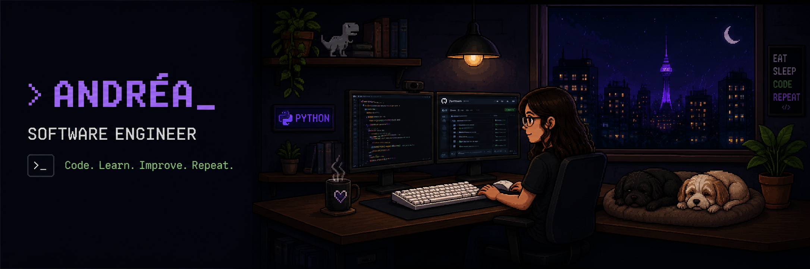

  

 

<table>
<tr>

<td width="50%" valign="top">

## 𓂃🪶 Sobre mim

🎓 Análise e Desenvolvimento de Sistemas

💻 Desenvolvedora apaixonada por tecnologia, automação e resolução de problemas.

🐍 Python

🧠 Atualmente estudando Inteligência Artificial e Machine Learning.

🎮 Gamer • Anime • Tecnologia

</td>

<td width="50%" valign="top">

## 🚨 Foco

- Automação de Processos
- Desenvolvimento Python
- SQL & Banco de Dados
- Inteligência Artificial

</td>

</tr>
</table>

---

# 👾 Tech Stack

---

# 📫 Contato

---

> *Every bug defeated is one XP earned.*

